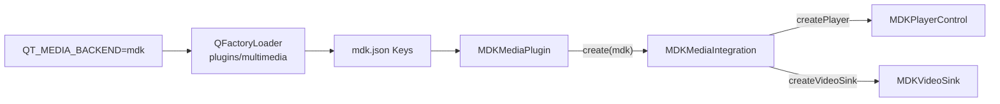
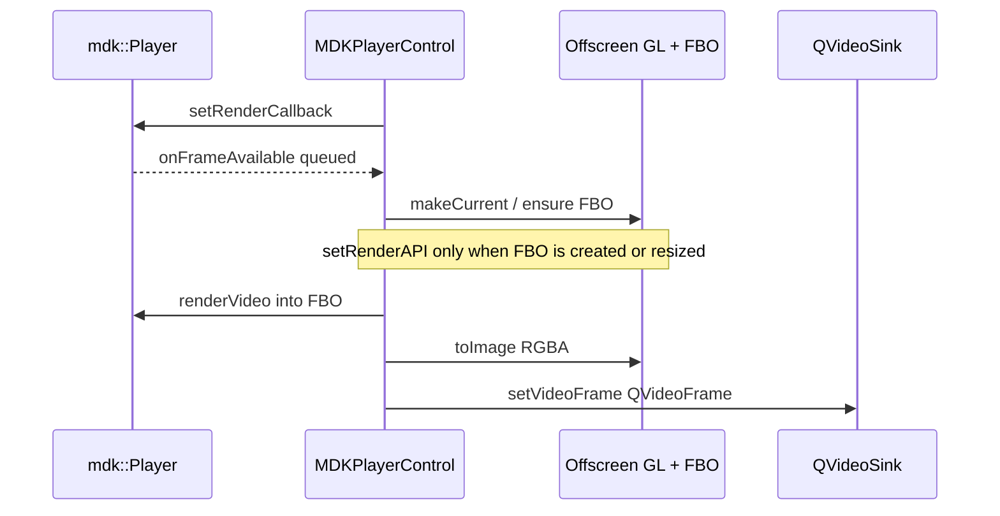

# Qt6 MDK Multimedia Plugin — Design

This document describes the architecture of the **Qt 6.4+** MDK multimedia backend plugin (`mdkmediaplugin`). The Qt5 mediaservice plugin under [`qt5/`](qt5/) is a separate, older integration and is out of scope here.

## Goals

- Provide a **playback-only** Qt Multimedia backend powered by [mdk-sdk](https://github.com/wang-bin/mdk-sdk).
- Selectable at runtime via `QT_MEDIA_BACKEND=mdk`.
- Depend only on **public** MDK headers (`mdk/Player.h`, …) from a packaged SDK — not ABI/internal headers.
- Survive Qt 6 private-API drift across minor versions (6.4 → 6.5 `QMaybe` → 6.10 `q23::expected`).

Non-goals (v1): camera, capture session, recorder, screen/window capture, RHI zero-copy video.

## How Qt loads the backend

Qt Multimedia discovers backends under `plugins/multimedia/` using `QFactoryLoader` and IID `org.qt-project.Qt.QPlatformMediaPlugin`.



Selection order (simplified): env `QT_MEDIA_BACKEND` → preferred backend → compile-time default → platform default (often `ffmpeg`). If loading the chosen key fails (e.g. missing `mdk.framework`), Qt tries other backends silently.

Metadata ([`qt6/mdk.json`](qt6/mdk.json)):

```json
{ "Keys": [ "mdk" ] }
```

## Component map

| Class | Base | Role |
|-------|------|------|
| `MDKMediaPlugin` | `QPlatformMediaPlugin` | Plugin entry; returns integration for key `"mdk"`. |
| `MDKMediaIntegration` | `QPlatformMediaIntegration("mdk")` | Factory for player and video sink only. |
| `MDKPlayerControl` | `QObject` + `QPlatformMediaPlayer` | Owns `mdk::Player`; maps Qt player API ↔ MDK. |
| `MDKVideoSink` | `QPlatformVideoSink` | Thin handle; frames are pushed to `QVideoSink` from the player. |
| `qtcompat.h` | — | Macros for `create*()` return types across Qt minors. |

Camera / recorder / capture factories are left as base-class “not available”.

Default `createAudioOutput` is used: Qt still owns `QAudioOutput` / device enumeration; the player only consumes volume, mute, and device id.

## Public vs private Qt APIs

The plugin is an **out-of-tree** backend. It must link `Qt6::MultimediaPrivate` and include private headers such as:

- `qplatformmediaplugin_p.h`
- `qplatformmediaintegration_p.h`
- `qplatformmediaplayer_p.h`
- `qplatformvideosink_p.h`
- `qplatformaudiooutput_p.h`

These are not a stable public SDK; [`qt6/qtcompat.h`](qt6/qtcompat.h) isolates the known `create*()` signature change:

| Qt version | Return type |
|------------|-------------|
| 6.4 | `T*` (`nullptr` = failure) |
| 6.5–6.9 | `QMaybe<T*>` |
| ≥ 6.10 | `q23::expected<T*, QString>` |

## Playback control (`MDKPlayerControl`)

One `mdk::Player` instance per `QMediaPlayer`.

### Control mapping

| Qt (`QPlatformMediaPlayer`) | MDK |
|-----------------------------|-----|
| `setMedia(url, stream)` | `setMedia` / `stream:` + `appendBuffer` for `QIODevice` |
| play / pause / stop | `set(State::Playing/Paused/Stopped)` |
| position / seek | `position()` / `seek()` |
| playback rate | `setPlaybackRate` / `playbackRate` |
| loops | `setLoop` (`Infinite` → `-1`) |
| tracks | `mediaInfo()` + `setActiveTracks` |
| metadata | mapped from `mediaInfo().metadata` / codecs |
| buffer progress / ranges | `buffered()` / `bufferedTimeRanges()` (+ `demux.buffer.ranges` property) |
| volume / mute / device | from `QPlatformAudioOutput` → `setVolume` / `setMute` / property `"audio.device"` |

State and media status are bridged with queued invokes onto the Qt thread via `onStateChanged` / `onMediaStatus`. Decoder failures use `onEvent` (categories `decoder.audio` / `decoder.video`); prepare failure (`position < 0`) maps to `ResourceError`.

Active-track **getter** is cached in the plugin when the packaged SDK has no `Player::activeTracks()` yet. Selection still calls `setActiveTracks`.

### Media / I/O

- Local file / network URL: `setMedia` with path or URL string.
- `QIODevice`: no public `MediaIO` in mdk-sdk → open `"stream:"` and pump data with `appendBuffer` on a timer.
- `qrc:` is not supported end-to-end (`canPlayQrc() == false`); apps should open a `QFile` / `QIODevice` themselves.

## Video path

Target: deliver frames into `QVideoSink` so Widgets and Qt Quick `VideoOutput` work without a custom RHI node.



Details:

1. Shared / offscreen `QOpenGLContext` + `QOffscreenSurface`.
2. `QOpenGLFramebufferObject` sized to the video.
3. `GLRenderAPI.fbo = fbo->handle()` via `setRenderAPI` **only when the FBO changes** (create/resize), not every frame.
4. Y-flip via `player.scale(1, -1)` when the FBO is (re)created.
5. Readback to `QImage` → `QVideoFrameFormat::Format_RGBA8888` → `QVideoSink::setVideoFrame`.

`MDKVideoSink` does not own GL resources; it exists so `createVideoSink` succeeds. Future work may add foreign RHI (`Metal` / `D3D` / `Vulkan`) using MDK `RenderAPI` for zero-copy.

## Audio path

MDK plays audio with its own backends (AudioQueue, XAudio2, ALSA, …). The plugin:

- Does **not** replace MDK’s audio graph with Qt’s `QAudioSink`.
- Syncs `QAudioOutput` volume / mute / device id into MDK.
- Device id is passed as property `"audio.device"` (packaged SDK may lack `setAudioDevice` / `audioDevices`).

Qt continues to enumerate devices for the UI; id formats may differ by OS/backend.

## Build and deployment

Out-of-tree CMake ([`CMakeLists.txt`](CMakeLists.txt)):

1. `find_package(Qt6 … MultimediaPrivate)`.
2. `MDK_SDK` default `./mdk-sdk`; `include(${MDK_SDK}/lib/cmake/FindMDK.cmake)`.
3. `qt_add_plugin(… PLUGIN_TYPE multimedia)` + `target_link_libraries(… mdk)`.
4. Install plugin to `${Qt}/plugins/multimedia/`.
5. Install runtime via FindMDK variables:
   - `MDK_FRAMEWORK` → `${Qt}/lib/` (macOS), or
   - `MDK_RUNTIMES` → `${Qt}/lib/` or `${Qt}/bin/` (Linux / Windows).

Plugin `INSTALL_RPATH` is `@loader_path/../../lib`, matching other Qt multimedia plugins. **Without installing the MDK runtime into that lib directory, dyld/ELF fails to load the plugin and Qt falls back to another backend.**

## Qt5 vs Qt6 (contrast)

| | Qt5 (`qt5/`) | Qt6 (`qt6/`) |
|--|--------------|--------------|
| Plugin type | `mediaservice` | `multimedia` |
| Entry | `QMediaServiceProviderPlugin` | `QPlatformMediaPlugin` |
| Selection | `QT_MULTIMEDIA_PREFERRED_PLUGINS` | `QT_MEDIA_BACKEND` |
| Key | historically `mdkservice` | `mdk` |
| Video to app | `QAbstractVideoSurface` / OpenGL widget | `QVideoSink` + FBO readback |
| Build | qmake | CMake + FindMDK |

## Limitations and future work

- FBO CPU readback is portable but not zero-copy; RHI foreign rendering is deferred.
- No capture/camera stack.
- Packaged SDK gaps (commented or worked around in code): dedicated `onError`, `setAudioDevice` / `audioDevices`, `activeTracks` getter — use `onEvent`, `"audio.device"`, and a local track cache until SDK headers expose them.
- Android multi-ABI library naming mismatch with Qt’s ABI-suffixed plugins remains an install concern.

## File layout

```
qt6/
  mdk.json                    # Keys: ["mdk"]
  mdkplatformmediaplugin.*    # QPlatformMediaPlugin
  mdkmediaintegration.*       # QPlatformMediaIntegration
  mdkplayercontrol.*          # QPlatformMediaPlayer + mdk::Player
  mdkvideosink.*              # QPlatformVideoSink
  qtcompat.h                  # create*() return-type shims
CMakeLists.txt                # out-of-tree build / install
```
