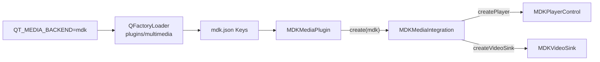
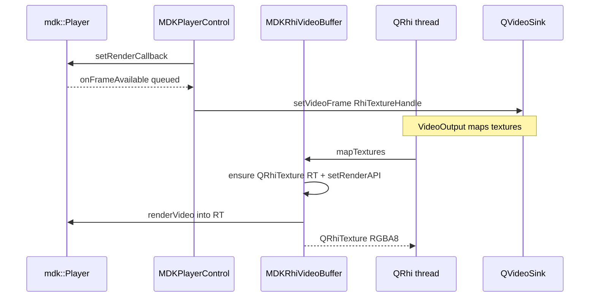

# Qt6 MDK Multimedia Plugin — Design

This document describes the architecture of the **Qt 6.4+** MDK multimedia backend plugin (`mdkmediaplugin`). The Qt5 mediaservice plugin under [`qt5/`](qt5/) is a separate, older integration and is out of scope here.

## Goals

- Provide a **playback-only** Qt Multimedia backend powered by [mdk-sdk](https://github.com/wang-bin/mdk-sdk).
- Selectable at runtime via `QT_MEDIA_BACKEND=mdk`.
- Depend only on **public** MDK headers (`mdk/Player.h`, …) from a packaged SDK — not ABI/internal headers.
- Survive Qt 6 private-API drift across the supported range (6.4 raw pointers → 6.5–6.9 `QMaybe` → 6.10 `q23::expected`).

Non-goals (v1): camera, capture session, recorder, screen/window capture.

## How Qt loads the backend

Qt Multimedia discovers backends under `plugins/multimedia/` using `QFactoryLoader` and IID `org.qt-project.Qt.QPlatformMediaPlugin`.



Selection order (simplified): env `QT_MEDIA_BACKEND` → preferred backend → compile-time default → platform default (often `ffmpeg`). If loading the chosen key fails (e.g. missing `mdk.framework`), Qt tries other backends silently.

Metadata ([`qt6/mdk.json`](qt6/mdk.json)):

```json
{ "Keys": [ "mdk" ] }
```

## Component map

| Class | Base | Role |
|-------|------|------|
| `MDKMediaPlugin` | `QPlatformMediaPlugin` | Plugin entry; returns integration for key `"mdk"`. |
| `MDKMediaIntegration` | `QPlatformMediaIntegration("mdk")` | Factory for player and video sink only. |
| `MDKPlayerControl` | `QObject` + `QPlatformMediaPlayer` | Owns `mdk::Player`; maps Qt player API ↔ MDK. |
| `MDKVideoSink` | `QPlatformVideoSink` | Thin handle; frames are pushed to `QVideoSink` from the player. |
| `qtcompat.h` | — | Macros for `create*()` return types across Qt minors. |

Camera / recorder / capture factories are left as base-class “not available”.

Default `createAudioOutput` is used: Qt still owns `QAudioOutput` / device enumeration; the player only consumes volume, mute, and device id.

## Public vs private Qt APIs

The plugin is an **out-of-tree** backend. It must link `Qt6::MultimediaPrivate` and include private headers such as:

- `qplatformmediaplugin_p.h`
- `qplatformmediaintegration_p.h`
- `qplatformmediaplayer_p.h`
- `qplatformvideosink_p.h`
- `qplatformaudiooutput_p.h`

These are not a stable public SDK; [`qt6/qtcompat.h`](qt6/qtcompat.h) isolates the known `create*()` signature change:

| Qt version | Return type |
|------------|-------------|
| 6.4 | `T*` (`nullptr` = failure) |
| 6.5–6.9 | `QMaybe<T*>` |
| ≥ 6.10 | `q23::expected<T*, QString>` |

Qt 6.4 uses `QAbstractVideoBuffer::mapTextures()` without an RHI argument;
the plugin renders there and exposes the native texture through
`textureHandle()`. Qt 6.5–6.7 use `QVideoFrameTextures` with
`mapTextures(QRhi *)`; Qt 6.8.0 and 6.8.1 use `QHwVideoBuffer` with the same
pointer-only signature. These versions have no `oldTextures` handoff and use
the legacy shared render target. Qt 6.8.2 and later add the `oldTextures`
handoff used by the optional texture-pool path.

## Playback control (`MDKPlayerControl`)

One `mdk::Player` instance per `QMediaPlayer`.

### Control mapping

| Qt (`QPlatformMediaPlayer`) | MDK |
|-----------------------------|-----|
| `setMedia(url, stream)` | `setMedia` / `stream:` + `appendBuffer` for `QIODevice` |
| play / pause / stop | `set(State::Playing/Paused/Stopped)` |
| position / seek | `position()` / `seek()` |
| playback rate | `setPlaybackRate` / `playbackRate` |
| loops | `setLoop` (`Infinite` → `-1`) |
| tracks | `mediaInfo()` + `setActiveTracks` |
| metadata | mapped from `mediaInfo().metadata` / codecs |
| buffer progress / ranges | `buffered()` / `bufferedTimeRanges()` (+ `demux.buffer.ranges` property) |
| volume / mute / device | from `QPlatformAudioOutput` → `setVolume` / `setMute` / property `"audio.device"` |

State and media status are bridged with queued invokes onto the Qt thread via `onStateChanged` / `onMediaStatus`. Decoder failures use `onEvent` (categories `decoder.audio` / `decoder.video`); prepare failure (`position < 0`) maps to `ResourceError`.

Active-track **getter** is cached in the plugin when the packaged SDK has no `Player::activeTracks()` yet. Selection still calls `setActiveTracks`.

### Media / I/O

- Local file / network URL: `setMedia` with path or URL string.
- `QIODevice`: no public `MediaIO` in mdk-sdk → open `"stream:"` and pump data with `appendBuffer` on a timer.
- `qrc:` is not supported end-to-end (`canPlayQrc() == false`); apps should open a `QFile` / `QIODevice` themselves.

## Video path

Target: deliver frames into `QVideoSink` through the presentation side's QRhi so Qt Quick `VideoOutput` and other RHI-based outputs work without a custom RHI node.

When `QVideoSink::rhi()` is set (for example, by Qt Quick `VideoOutput` or an RHI-based window), frames use **zero-copy QRhi textures**. The current implementation supports only the supported QRhi backends listed below; if no RHI is available or the backend is unsupported, no video frame is submitted because there is no CPU/FBO fallback.

### QRhi path (supported path)



Details ([`qt6/mdkrihiframe.*`](../qt6/mdkrihiframe.*), patterned on libmdk `examples/Qt/{qmlrhi,rhiwidget}`):

1. `onFrameAvailable` pushes an `MDKRhiVideoBuffer` (the version-specific Qt private video buffer / `RhiTextureHandle`) without rendering yet.
2. Qt maps the frame on the **RHI thread** via `mapTextures()`.
3. There the plugin creates/resizes a `QRhiTexture` (RGBA8, RenderTarget), binds MDK `RenderAPI` (Metal / D3D11 / D3D12 / Vulkan / OpenGL FBO from `QGles2TextureRenderTarget`), and calls `renderVideo()`.
4. On Qt 6.5+, the returned `QVideoFrameTextures` exposes that texture to Multimedia's video node;
   Qt 6.4 instead wraps the native handle returned by `textureHandle()`.

When built with `-DMDK_USE_QT_RHI_TEXTURE_POOL=ON` against Qt 6.8.2 or later, the plugin uses the `oldTextures` handoff from Qt's internal `QVideoFrameTexturePool`. Each live RHI frame slot owns a separate texture/RT set, and a set is reused only after Qt returns that same slot. Because MDK has one default renderer, `setRenderAPI` is rebound before every pooled draw. The option defaults to `OFF`; on Qt 6.4–6.8.1, or when the option/capability is unavailable, the legacy shared render target remains in use and `setRenderAPI` runs only when the target is (re)created. Y-flip (`scale(1,-1)`) is applied for OpenGL only.

There is currently no CPU or offscreen-OpenGL fallback. A `QVideoSink` without a supported QRhi is therefore not a video output for this backend.

`MDKVideoSink` remains a thin `QPlatformVideoSink`; RHI comes from `QVideoSink::rhi()` set by the presentation side.

## Audio path

MDK plays audio with its own backends (AudioQueue, XAudio2, ALSA, …). The plugin:

- Does **not** replace MDK’s audio graph with Qt’s `QAudioSink`.
- Syncs `QAudioOutput` volume / mute / device id into MDK.
- Device id is passed as property `"audio.device"` (packaged SDK may lack `setAudioDevice` / `audioDevices`).

Qt continues to enumerate devices for the UI; id formats may differ by OS/backend.

## Build and deployment

Out-of-tree CMake ([`CMakeLists.txt`](CMakeLists.txt)):

1. `find_package(Qt6 6.4.0 REQUIRED … MultimediaPrivate)`; the CMake project rejects older Qt 6 versions.
2. `MDK_SDK` default `./mdk-sdk`; `include(${MDK_SDK}/lib/cmake/FindMDK.cmake)`.
3. `qt_add_plugin(… PLUGIN_TYPE multimedia)` + `target_link_libraries(… mdk)`.
4. Install plugin to `${Qt}/plugins/multimedia/`.
5. Install runtime via FindMDK variables:
   - `MDK_FRAMEWORK` → `${Qt}/lib/` (macOS), or
   - `MDK_RUNTIMES` → `${Qt}/lib/` (Linux/other Unix) or `${Qt}/bin/` (Windows).

The installed plugin uses a platform-relative RPATH: `@loader_path/../../lib` on macOS and `$ORIGIN/../../lib` on Linux/other Unix targets. Windows does not use an ELF/macOS RPATH; its runtime files are installed next to the Qt binaries. **Without installing the MDK runtime into the corresponding Qt lib/bin directory, the platform loader fails to load the plugin and Qt falls back to another backend.**

## Qt5 vs Qt6 (contrast)

| | Qt5 (`qt5/`) | Qt6 (`qt6/`) |
|--|--------------|--------------|
| Plugin type | `mediaservice` | `multimedia` |
| Entry | `QMediaServiceProviderPlugin` | `QPlatformMediaPlugin` |
| Selection | `QT_MULTIMEDIA_PREFERRED_PLUGINS` | `QT_MEDIA_BACKEND` |
| Key | historically `mdkservice` | `mdk` |
| Video to app | `QAbstractVideoSurface` / OpenGL widget | `QVideoSink` + supported QRhi |
| Build | qmake | CMake + FindMDK |

## Limitations and future work

- No CPU/FBO fallback is provided when no supported `QVideoSink` RHI is available.
- No capture/camera stack.
- Packaged SDK gaps (commented or worked around in code): dedicated `onError`, `setAudioDevice` / `audioDevices`, `activeTracks` getter — use `onEvent`, `"audio.device"`, and a local track cache until SDK headers expose them.
- Android multi-ABI library naming mismatch with Qt’s ABI-suffixed plugins remains an install concern.

## File layout

```
qt6/
  mdk.json                    # Keys: ["mdk"]
  mdkplatformmediaplugin.*    # QPlatformMediaPlugin
  mdkmediaintegration.*       # QPlatformMediaIntegration
  mdkplayercontrol.*          # QPlatformMediaPlayer + mdk::Player
  mdkrihiframe.*              # QRhiTexture Qt video-buffer path
  mdkvideosink.*              # QPlatformVideoSink
  qtcompat.h                  # create*() return-type shims
CMakeLists.txt                # out-of-tree build / install
```
